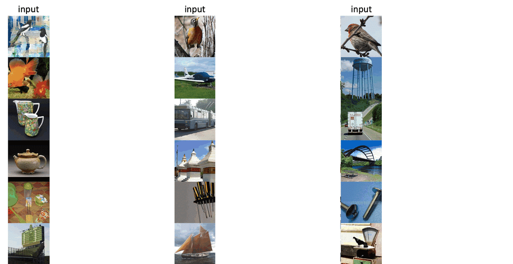

# DynamicViT: Efficient Vision Transformers with Dynamic Token Sparsification

Created by [Yongming Rao](https://raoyongming.github.io/), [Wenliang Zhao](https://thu-jw.github.io/), [Benlin Liu](https://liubl1217.github.io/), [Jiwen Lu](https://scholar.google.com/citations?user=TN8uDQoAAAAJ&hl=en&authuser=1), [Jie Zhou](https://scholar.google.com/citations?user=6a79aPwAAAAJ&hl=en&authuser=1), [Cho-Jui Hsieh](http://web.cs.ucla.edu/~chohsieh/)

This repository contains PyTorch implementation for DynamicViT (NeurIPS 2021).

DynamicViT is a dynamic token sparsification framework to prune redundant tokens in vision transformers progressively and dynamically based on the input. Our method
can reduces over **30%** FLOPs and improves the throughput by over **40%** while the drop of accuracy is within **0.5%** for various vision transformers




Our code is based on [pytorch-image-models](https://github.com/rwightman/pytorch-image-models), [DeiT](https://github.com/facebookresearch/deit) and [LV-ViT](https://github.com/zihangJiang/TokenLabeling)

[[Project Page]](https://dynamicvit.ivg-research.xyz/) [[arXiv]](https://arxiv.org/abs/2106.02034)

## Model Zoo

We provide our DynamicViT models pretrained on ImageNet:
| name | arch | rho | acc@1 | acc@5 | FLOPs | url |
| --- | --- | --- | --- | --- | --- | --- |
| DynamicViT-256/0.7 | ```deit_256``` | 0.7 | 76.532 | 93.118 | 1.3G | [Google Drive](https://drive.google.com/file/d/1fpdTNRZtGOW25UwOadj1iUdjqmu88WkO/view?usp=sharing) / [Tsinghua Cloud](https://cloud.tsinghua.edu.cn/f/ebda4114758f44d78bc0/?dl=1) |
| DynamicViT-384/0.7 | ```deit_small``` | 0.7 | 79.316 | 94.676 | 2.9G | [Google Drive](https://drive.google.com/file/d/1H5kHHagdqo4emk9CgjfA7DA62XJr8Yc1/view?usp=sharing) / [Tsinghua Cloud](https://cloud.tsinghua.edu.cn/f/58461f395c8f4829be85/?dl=1)|
| DynamicViT-LV-S/0.5 | ```lvvit_s``` | 0.5 | 81.970 | 95.756 | 3.7G | [Google Drive](https://drive.google.com/file/d/1kPe3MhtYHNdG7natrU20xcAqodO6-Z58/view?usp=sharing) / [Tsinghua Cloud](https://cloud.tsinghua.edu.cn/f/9d62a51e6fbb45c38a31/?dl=1) |
| DynamicViT-LV-S/0.7 | ```lvvit_s``` | 0.7 | 83.076 | 96.252 | 4.6G | [Google Drive](https://drive.google.com/file/d/1dNloEsuEiTi592SdM_ELC36kOJ7aaF-3/view?usp=sharing) / [Tsinghua Cloud](https://cloud.tsinghua.edu.cn/f/abe3e31af253476ea628/?dl=1)|
| DynamicViT-LV-M/0.7 | ```lvvit_m``` | 0.7 | 83.816 | 96.584 | 8.5G | [Google Drive](https://drive.google.com/file/d/1dNab1B5ZOTVNpnpO6H1TsXKFM8BAlA3I/view?usp=sharing) / [Tsinghua Cloud](https://cloud.tsinghua.edu.cn/f/5a1c519a39214fa6bc67/?dl=1) |

## Usage

### Requirements

- torch>=1.7.0
- torchvision>=0.8.1
- timm==0.4.5

**Data preparation**: download and extract ImageNet images from http://image-net.org/. The directory structure should be

```
│ILSVRC2012/
├──train/
│  ├── n01440764
│  │   ├── n01440764_10026.JPEG
│  │   ├── n01440764_10027.JPEG
│  │   ├── ......
│  ├── ......
├──val/
│  ├── n01440764
│  │   ├── ILSVRC2012_val_00000293.JPEG
│  │   ├── ILSVRC2012_val_00002138.JPEG
│  │   ├── ......
│  ├── ......
```

**Model preparation**: download pre-trained DeiT and LV-ViT models for training DynamicViT:
| model | url |
| --- | --- | 
| DeiT-Small | [link](https://dl.fbaipublicfiles.com/deit/deit_small_patch16_224-cd65a155.pth) |
| LVViT-S | [Google Drive](https://drive.google.com/file/d/1OSQ3l1yoz5YbsvHy3VjLoipR4jFHFOIS/view?usp=sharing) / [Tsinghua Cloud](https://cloud.tsinghua.edu.cn/f/544d651ec2a14da0a37c/?dl=1) |
| LVViT-M | [Google Drive](https://drive.google.com/file/d/1iZc6d27EuEnlfUpJoNhsZEkt6GVgPy7-/view?usp=sharing) / [Tsinghua Cloud](https://cloud.tsinghua.edu.cn/f/c690596b7ead4813ad0b/?dl=1) |

Since the original links of LVViT models are not available now ([#4](https://github.com/raoyongming/DynamicViT/issues/4)), we provide the models used in our experiments on Google Drive and Tsinghua Cloud.


### Demo

You can try DynamicViT on Colab [![][colab]][colab-dynamicvit]. Thanks [@dirtycomputer](https://github.com/dirtycomputer) for the contribution.  

[colab]: <https://colab.research.google.com/assets/colab-badge.svg>
[colab-dynamicvit]: <https://colab.research.google.com/github/raoyongming/DynamicViT/blob/master/colab_demo.ipynb>


We also provide a [Jupyter notebook](https://github.com/raoyongming/DynamicViT/blob/master/viz_example.ipynb) where you can run the visualization of DynamicViT.

To run the demo, you need to install ```matplotlib```.


### Evaluation

To evaluate a pre-trained DynamicViT model on the ImageNet validation set with a single GPU, run:

```
python infer.py --data-path /path/to/ILSVRC2012/ --arch arch_name --model-path /path/to/model --base_rate 0.7 
```


### Training

To train DynamicViT models on ImageNet, run:

DeiT-small
```
python -m torch.distributed.launch --nproc_per_node=8 --use_env main_dynamic_vit.py  --output_dir logs/dynamic-vit_deit-small --arch deit_small --input-size 224 --batch-size 96 --data-path /path/to/ILSVRC2012/ --epochs 30 --dist-eval --distill --base_rate 0.7
```

LV-ViT-S
```
python -m torch.distributed.launch --nproc_per_node=8 --use_env main_dynamic_vit.py  --output_dir logs/dynamic-vit_lvvit-s --arch lvvit_s --input-size 224 --batch-size 64 --data-path /path/to/ILSVRC2012/ --epochs 30 --dist-eval --distill --base_rate 0.7
```

LV-ViT-M
```
python -m torch.distributed.launch --nproc_per_node=8 --use_env main_dynamic_vit.py  --output_dir logs/dynamic-vit_lvvit-m --arch lvvit_m --input-size 224 --batch-size 48 --data-path /path/to/ILSVRC2012/ --epochs 30 --dist-eval --distill --base_rate 0.7
```

You can train models with different keeping ratio by adjusting ```base_rate```. DynamicViT can also achieve comparable performance with only 15 epochs training (around 0.1% lower accuracy compared to 30 epochs). 

## License
MIT License

## Citation
If you find our work useful in your research, please consider citing:
```
@inproceedings{rao2021dynamicvit,
  title={DynamicViT: Efficient Vision Transformers with Dynamic Token Sparsification},
  author={Rao, Yongming and Zhao, Wenliang and Liu, Benlin and Lu, Jiwen and Zhou, Jie and Hsieh, Cho-Jui},
  booktitle = {Advances in Neural Information Processing Systems (NeurIPS)},
  year = {2021}
}
```
